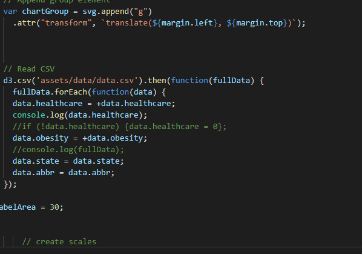
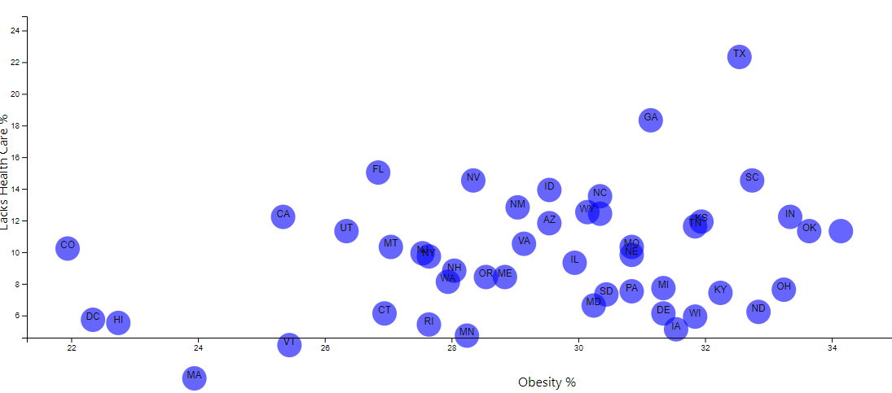

# D3-challenge
Created a scatter plot between two data variables Healthcare vs. Obesity.

Using the D3 techniques created a scatter plot that represents each state with circle elements. Coded this graphic in the app.js file of the directory made sure to pull in the data from data.csv by using the d3.csv function. 

Included state abbreviations in the circles of the scatter plot.
Created and situated axes and labels to the left and bottom of the chart.
Used python -m http.server to run the visualization. 

